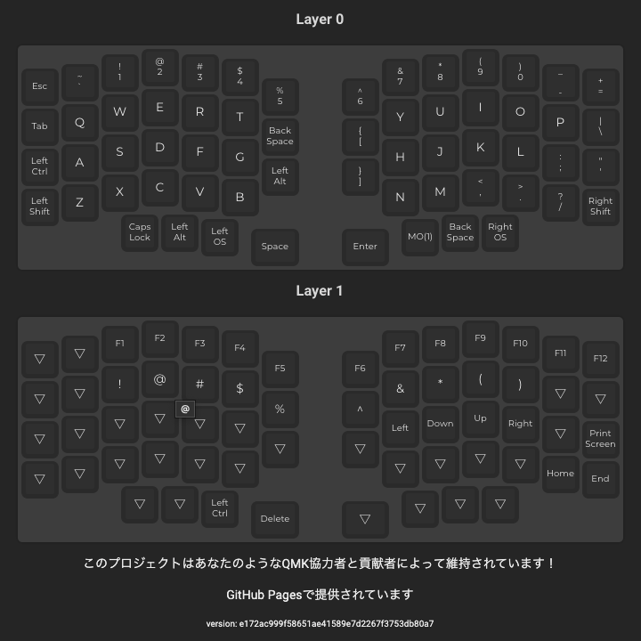

1年ほど前にこしらえた自作キーボードでpc作業を行なっています。

久しぶりにキーマップを変えようと思ったらびっくりするくらいやり方を忘れており、思い出すのに結構時間が掛かったため未来の自分用に忘備録としてやり方を残しておきます。

[【自作キーボード】Sparrow62を組み立てた](https://reiichii.hateblo.jp/entry/2021/05/04/210513)

## やること

* キーマップの設計
* キーボードのfirmwareに書き込む

### キーマップの設計

キーマップの設計は、[QMK Configurator](https://config.qmk.fm/#/sparrow62/LAYOUT)というWebアプリからGUIで行います。

1. 前の設定を読み込ませる
   - KEYBOARDを自分が使っているものに選択する
   - urlからjsonをアップロードするボタンを押下し、keymap.json（以前の設定時にexportしておいたもの）のrowファイルのurlを読み込ませる
2. 画面ぽちぽちでキーマップの配置を変更する
3. 右上のCOMPILEボタンを押下する
4. 右下のFIRMWAREボタンを押下し、hexファイルをダウンロードする

後の作業のために、この画面はまだ閉じないでおく。

参考：[（初心者編）QMK Configuratorを使ってキーマップを書き換えよう \- 自作キーボード温泉街の歩き方](https://salicylic-acid3.hatenablog.com/entry/qmk-configurator)

### キーボードのfirmwareに書き込む

ローカルPCにインストール済みのQMK Toolboxに先ほどのhexファイルを読み込ませ、キーボードのfirmwareに書き込みます。キーボードは左右繋げたままにして、左右それぞれに書き込みをします。

1. QMK Toolboxを開く
2. 先ほどダウンロードしたhexファイルを読み込ませる
3. autoreloadにチェックをする
4. キーボードのリセットボタンを1度押下する
    - 書き込みが始まり、「done. thank you. disconnect」の文言が出たら無事成功
5. 反対のキーボードにケーブルを差し、3と4を行う

QMK ConfiguratorのTEST KEYBOARDでキーボードのボタンに意図した変更が反映されていることを確認する。

参考：[（初心者編）自作キーボードにファームウェアを書き込む \- 自作キーボード温泉街の歩き方](https://salicylic-acid3.hatenablog.com/entry/qmk-toolbox)

### 後片付け

* QMK Configuratorでjsonファイルをexportしておく（次回また読み込ませるため）
* PRINT KEYMAPで画像をスクショしておく（稀にボタンの配置がどうなっていたのか見返したくなるため）
* 上記をkeymapリポジトリに反映させておく

## おわりに

初回は設定で精一杯で運用(?)のことを全然考えていなかったので、「あれjsonファイル出力してたっけ」「キーマップの画像をスクショしておいたはずなんだけどどこやったっけ」なんてわたわたしていました。githubに上げておけば家からでも会社からでもキーマップ確認できるし、これできっと一安心😌

