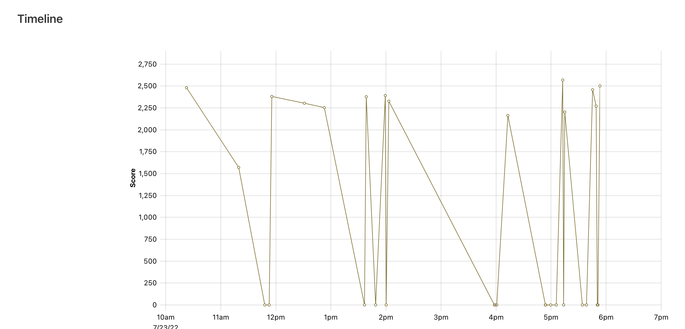
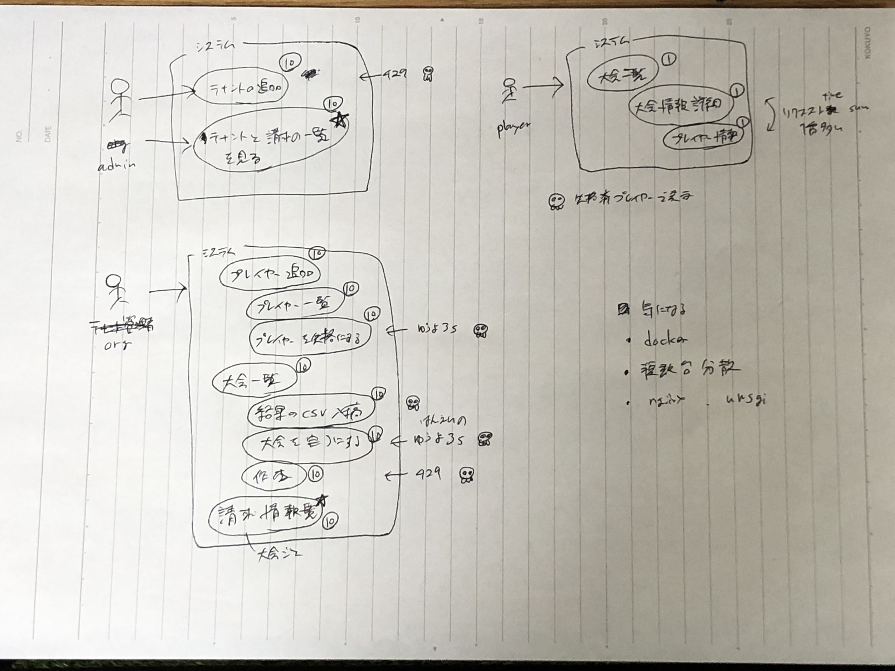

ISUCON12予選に参加しました。結果は散々だったのですが振り返りも兼ねて残しておこうと思います。



## ステータス

* 初出場
* Python
* 1人チーム
* 2502点

目標は「闇雲に手を動かずに爪痕残す」でした。
爪痕は残せませんでした🪦

## 準備

やっていたこととしては以下です。

* ISUCON11予選過去問解く
  - alpやmysqlのslow query logなどの計測ツールを使えるようになっておくこと
* 6月に行われた事前講習とハンズオンへの参加
  - 普段rubyさわらないので多少やりにくかったのですが、出て良かったです。
* ISUCON用ansible playbookを用意
  - 計測ツールの導入をスムーズに行うため準備していました

## タイムライン

* 09:40~ 配信視聴
  - 予選問題の概要を聞く
* 10:00~ 開始
  - ポータルサイト一通り見る（感動した）
  - 当日レギュレーションを読む
  - マニュアルを読む
  - 読みながらアプリケーションを触ったり、ユースケース図を書いて仕様を把握
  - サーバへのssh接続確認
* 11:00~ 準備
  - ソースコードをgit管理下に置く
  - 初回ベンチマークを実行
  - フワッと改善の目星をつける
  - サーバ構成をmysql用サーバとapplication用の2台構成に変更する
* 12:00~ 準備
  - 計測ツールの導入
  - nginxの設定ファイルをgit管理下に配置し直す
* 13:00~13:30 お昼休憩
  - 20分でご飯食べて10分昼寝。もうこの時点で結構疲れていた
  - 午前中はアプリケーションコードをほとんど見れていない
* 13:30~ 準備の延長戦
  - nginxの設定ファイルを間違えており、修正箇所探しに時間を潰す
* 14:00~ 改善開始
  - アプリケーションのコードを眺める
* 14:30~16:30 改善案1.スロウクエリを潰す試み
* 16:30~17:30 改善案2.リクエスト数の多いエンドポイントの改善
* 17:30~ 改善案3.bulkinsertに書き換えてみる
* 17:45~ 再起動チェック
* 18:00~19:00 競技終了・配信で講評を聞く

こうして振り返ってみると計測ツールをスムーズに導入できていれば+1hくらいコード読む時間を捻出できていましたね。ansibleを用意していたがちょこちょこ小さいエラーにはまって気がついたら1hほど経ってしまっていました。

今回の目標が闇雲に手を動かさないだったので、一応自分なりに根拠や狙いを持っていたつもりだったのですが、講評を聞く感じ的が外れていました。

### 改善案0.サーバの役割分担

サーバ構成をmysql用サーバとapplication用の2台構成に変更しました。

初回ベンチ実行時にtopの出力を眺めていたのですが、dbとpythonがcpuを食い潰しあっているように見えたため。先に分けた方が今後変化追いやすいかなと思ったというのもあります。

分けたことにより+500点ほどスコアが改善しました。goからpythonにしたときに下がった分が元に戻っただけなので実質プラマイ0ですね。

### 改善案1.料金集計処理のスロウクエリを潰す試み

* adminとorg系リクエストの配点が高いこと
* adminの一覧画面とorgの請求情報一覧画面が異様に重かったこと
* スロウクエリログで一番重かったクエリが、上記二つのリクエスト時に実行されるクエリだったこと

から、この処理を改善すればパフォーマンスが大きく改善するのではと着手することにしました。

それ自体は良かったのですが、 処理が参照しているデータ源がmysqlとsqliteに分かれていることからどうしたら良いものかと手が動かず。sqliteをmysqlに載せ替えるといった選択肢は効果が見込めるかどうか分からなかったので実施に踏み切れませんでした。

mysql側の改善をしようと検索件数を必要な分だけに絞ったりしていたのですが、ベンチマーカーによる整合性チェックでエラーが出てしまいました。この処理の改善に2hほどかけてしまっていたので中断することにしました。

[ログ](https://github.com/reiichii/isucon12-qualify/commit/855a3be79efea20a55c1bd6f6a04bb1f3d050d19)

### 改善案2. playerのリーダーボード一覧エンドポイントを改善する試み

* alpでリクエストを集計したところ合計レスポンスタイムが一番多かったのはplayerのリーダーボード一覧エンドポイントだったこと
* ベンチマーカーの出力に「leaderboardの表示に1秒以上かかったため2人の参加者が離脱しました。」のように出ていたこと

player系エンドポイントは、先ほどのadminやorg系エンドポイントと異なり加算は少ないのですが、上記の理由からここを改善すれば少なくともスコアがそれなりに改善される見込みがありました。

ただ参照先がsqliteのデータで、パフォーマンス改善ってどうやるんだと首を捻る羽目に。調べてみたらsqliteにもインデックスの概念があり、DB初期化スクリプトのcreate table sql見たところインデックスは貼られていなかったので試しに貼って見たのですが、ほとんどスコアに影響はありませんでした。

まだ改善の余地はあったのかもですが、この時点で残り1hを切ってしまっていたため一旦深追いをやめてしまいました。

[ログ](https://github.com/reiichii/isucon12-qualify/commit/82167412532d0dd2e789c27afb5ed6187d427c3b)

### 改善案3. forでinsertしている箇所をbulkinsertさせる

残り時間が微妙だったので、ソースコード眺めているときに気になっており、すぐに改善できそうな箇所として `/api/organizer/players/add` のinsert処理を書き換えようと思いました。実施して見たもののベンチマーカーがこけました。単純に書き換えるだけだと後続処理が意図した形に動かなかくなってしまうことに後から気づきました。

そもそもアプローチ方法が間違えていたのか、後続処理も合わせてなんとかする余地があったのか、残りが15分と検討する時間がもうなかったので中断しました。

[ログ](https://github.com/reiichii/isucon12-qualify/commit/e9bc7671bb06d673cb8a4061841e457da5d236ac)

## 問題の所感

* 「mysqlで準備していたからpostgresqlとかだったらきついな..まあスポンサーにmysqlがいるからないか」とか思っていたらまさかのmysql+sqliteでびっくり
* auto_incrementのところも何か変なコードがあるなぁとは思っていたのですが、料金表とリーダーボード表示の箇所にばかり気を取られていたので全然見れませんでした
* 講評で「インデックスを貼ればdbの負荷がひとまずは下がる」ようなことが言われていて、もう少しDB周りを重点的に確認すれば良かったです。見ていた箇所のクエリのインデックスは確認していたつもりだったのですがそうではなく、出てきたスロークエリに対してインデックスが効いているかを見ておくべきでした
* lockがやたら多いのも気にはなっていたのですが、トランザクションを使う箇所というのが出てきませんでした。ただの知見不足です
* ユースケース図を書いていたのですが、アプリの全体像を網羅的に把握するのに役立ちました。アプリケーションとdbのやりとり周りも何かしらの方法でスムーズに把握できるようになれると良かったのですが

## その他感想

* ISUCON11予選問題を解いていた時はアプリケーションの使用の仕様が難しく、何やっていいか全く分からない状態でした。それに比べたら今回の問題はまだその辺りの把握はしやすかったです
* ポータルサイトがどんなものかずっと見てみたかったので感動しました。終わった後速攻で選手用ページが見れなくなってしまい、ベンチマークのログやダッシュボードのスクショを取り損ねてしまいました
* 終わった後眼精疲労でくたくたで、速攻でpc閉じてしまったのですが、DCの方では感想戦で盛り上がっていて他の参加者のバイタリティの高さを感じました。翌朝読み返していて面白く、復習時の参考にまた読み返そうと思います
* 集中力は8h意外と持ちました。1h~1h30minにつき5minの休憩を無理やり設けるようにして良かったです

## おわりに

無念 : 楽しかった！ が 6:4の気持ちです。

あと目と手と頭が足りないです。本戦一人出場している人の凄さを実感します。私がアプリケーション側でもう少しまともに戦えるようになったら、次回は誰か誘ってみるのもありかもなと思えてしまいました。

今年もPythonでの本戦出場選手は出なかったのでPythonで狙いたいなと思う反面、業務で触らないgoの勉強の口実にしたいという気持ちのが強いので、来年はgoで10000点以上出すことを目標に出てみたいと思います。ベンチマーカーがgoで書かれていて、その辺りの処理ももう少し読めるようになりたいんですよね。

運営の皆様、開催ありがとうございました。

https://github.com/reiichii/isucon12-qualify

[計測ログ](https://github.com/reiichii/isucon12-qualify/issues/1)

