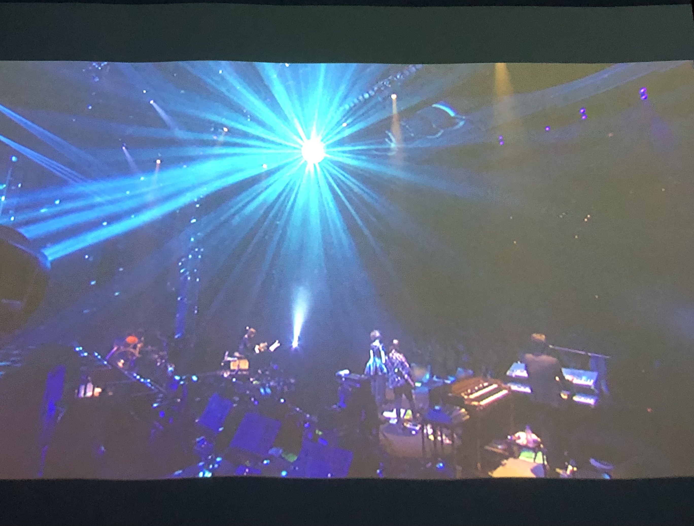

買ってまだ見ていないライブDVDをホテルに篭って鑑賞したいなー🥺🥺🥺そしてできれば大浴場と美味しい朝食も付いていて欲しいなー🥺🥺というところから始まり、有給取って行ってきました。

ただ残念ながら部屋にプロジェクターが付いていて、且つ持ち込みのDVDを再生できて、且つ大浴場が付いて、且つ一人二人用の部屋というのは探した限りでは見つからず、大浴場を諦めることにしました。

ただ偶然にもホテルから徒歩圏内で行けるところに銭湯があり、大浴場ではないもののサウナがあって温泉が沸いているとのことで結果的にほとんど叶いました。



行ったホテルはこちら。

ちょっとした問い合わせは全部公式サイトのチャットで済むのも便利で良かった。また行きたい。

<iframe src="https://hatenablog-parts.com/embed?url=https%3A%2F%2Fwww.slashhotels.com%2F" title="【公式】slash川崎 (スラッシュ川崎)｜デジタルテクノロジーを活用したライフスタイルホテル" class="embed-card embed-webcard" scrolling="no" frameborder="0" style="display: block; width: 100%; height: 155px; max-width: 680px; margin: 10px 0px;" loading="lazy"></iframe>

銭湯は歩いて5分ほどのところにある政之湯というところ。

建物は古くシャワーヘッドは動かず浴槽は小さいのですが、清潔感があって天井高くて居心地は良かったです。何よりサウナが付いていて(後から作られたのか綺麗だった)、川崎天然温泉なる黒い湯が沸いていました。

<iframe src="https://hatenablog-parts.com/embed?url=https%3A%2F%2Fk-o-i.jp%2Fkoten%2Fmasanoyu-kawa%2F" title="政の湯 | 【公式】神奈川の銭湯情報" class="embed-card embed-webcard" scrolling="no" frameborder="0" style="display: block; width: 100%; height: 155px; max-width: 680px; margin: 10px 0px;" loading="lazy"></iframe>

* 15:00 チェックイン
* 買い出し
* ライブDVD1本目鑑賞
* 銭湯行く
* 散歩がてらドミノピザ(徒歩10分)まで歩いて夕飯調達
* ライブDVD2本目鑑賞
* 寝る
* 起きる
* ホテルのカフェで朝食
* 読書
* 11:00 チェックアウト

な具合で巣篭もり満喫できて満足でした☺️

プロジェクターやDVD再生機器が必要なければ、スクリーンと大浴場(しかも温泉)と朝食付いたこちらのホテルに行きたかった。

また別の機会に。

<iframe src="https://hatenablog-parts.com/embed?url=https%3A%2F%2Fwww.superhotel.co.jp%2Fs_hotels%2Fginza%2F" title="【公式最安】スーパーホテルPremier銀座 - 東京都中央区銀座のビジネスホテル" class="embed-card embed-webcard" scrolling="no" frameborder="0" style="display: block; width: 100%; height: 155px; max-width: 680px; margin: 10px 0px;" loading="lazy"></iframe>
