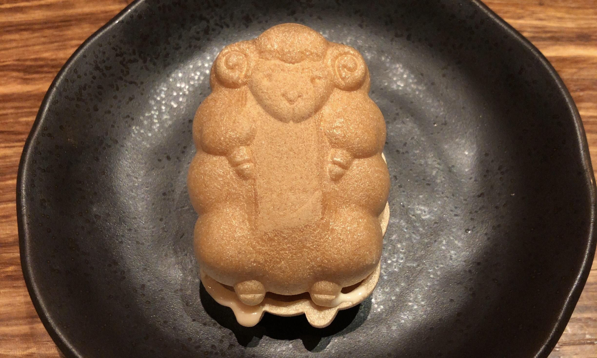

はてなからHugoで立てたブログに引っ越しました。

大きな理由としては、以前のブログの見た目が気に入らなかった（カスタマイズのコストが高い）ことと、vscodeとmarkdownでブログ書きたかったというのが主です。

デプロイ先はNetlifyを使おうか悩んだのですが、ブログの目的がアウトプットの習慣付けが主で、アクセス数稼ぎに力を入れていないことと、普段業務でGitLabを使うことが多かったので、GitHub PagesやCICDをちょっと触ってみたいなというのもあり、ミニマムにGitHub Pagesで始めてみることにしました。後から乗り換えることもできなくはないですし。その場合ドメイン変わってしまいますが個人ブログでリスクもないので気の向くままにやっていく方針で😌

既存のブログと記事は特にexportせずそのまま残しておく予定です。（もしかしたら戻る可能性もなくはないので）

これからもマイペースに続けていきたいと思います。

[以前のブログ](https://reiichii.hateblo.jp/)

